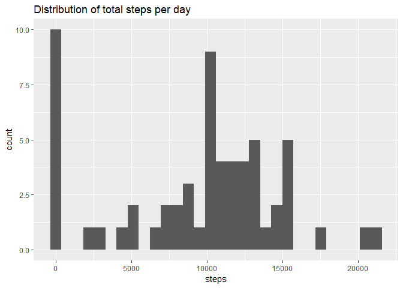
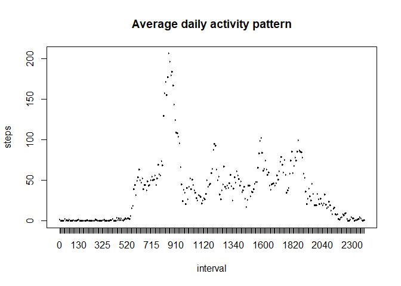
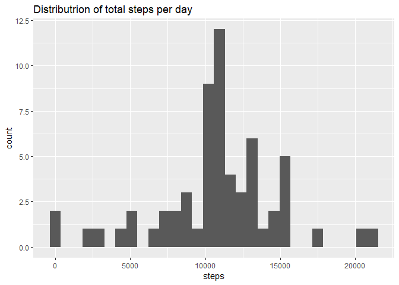
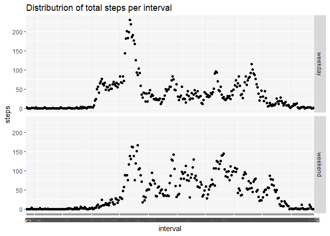

# Peer assignment course 5 - project 1

This is an R Markdown document of the first peer assignement in the 5th course of R for Data Science. 

## Read the data

Code for reading in the dataset and/or processing the data


```r
library(dplyr)
```

```
## Warning: package 'dplyr' was built under R version 3.5.1
```

```
## 
## Attaching package: 'dplyr'
```

```
## The following objects are masked from 'package:stats':
## 
##     filter, lag
```

```
## The following objects are masked from 'package:base':
## 
##     intersect, setdiff, setequal, union
```

```r
library(ggplot2)
```

```
## Warning: package 'ggplot2' was built under R version 3.5.1
```

```r
a <- read.csv("activity.csv")

a <- mutate(a,date=as.Date(date))
```

```
## Warning: package 'bindrcpp' was built under R version 3.5.1
```

```r
a <- mutate(a,interval=factor(interval))
```

## Total steps per day

Histogram of the total number of steps taken each day


```r
total.steps <- a %>% group_by(date) %>% summarize(steps=sum(steps,na.rm=TRUE)) 
ggplot(total.steps,aes(steps)) + geom_histogram() + ggtitle("Distribution of total steps per day")
```

```
## `stat_bin()` using `bins = 30`. Pick better value with `binwidth`.
```

<!-- -->

Mean and median number of steps taken each day 


```r
mean.steps <- mean(total.steps$steps,na.rm=TRUE)
print(mean.steps, digits=7)
```

```
## [1] 9354.23
```

```r
median.steps <- median(total.steps$steps,na.rm=TRUE)
print(median.steps)
```

```
## [1] 10395
```

## average daily acitivity pattern

Time series plot of the average number of steps taken


```r
daily.pattern <- a %>% group_by(interval) %>% summarize(steps=mean(steps,na.rm=TRUE))

plot(daily.pattern,type="l",main="Average daily activity pattern")
```

<!-- -->

## Interval with maximum number of steps

The 5-minute interval that, on average, contains the maximum number of steps is interval 835


```r
with(daily.pattern, daily.pattern[steps==max(steps),"interval"])
```

```
## # A tibble: 1 x 1
##   interval
##   <fct>   
## 1 835
```

## Missing values

Code to describe and show a strategy for imputing missing data
By the code given below it is shown that only "steps" contains NA elements
Strategy is to replace the NA in steps by the average steps at that interval


```r
summary(a)
```

```
##      steps             date               interval    
##  Min.   :  0.00   Min.   :2012-10-01   0      :   61  
##  1st Qu.:  0.00   1st Qu.:2012-10-16   5      :   61  
##  Median :  0.00   Median :2012-10-31   10     :   61  
##  Mean   : 37.38   Mean   :2012-10-31   15     :   61  
##  3rd Qu.: 12.00   3rd Qu.:2012-11-15   20     :   61  
##  Max.   :806.00   Max.   :2012-11-30   25     :   61  
##  NA's   :2304                          (Other):17202
```

```r
count(a[is.na(a$date),])
```

```
## # A tibble: 1 x 1
##       n
##   <int>
## 1     0
```

```r
count(a[is.na(a$interval),])
```

```
## # A tibble: 1 x 1
##       n
##   <int>
## 1     0
```

```r
count(a[is.na(a$steps),])
```

```
## # A tibble: 1 x 1
##       n
##   <int>
## 1  2304
```

```r
# impute average steps at specific interval for na values
a.new <- mutate(a, steps=ifelse(is.na(a$steps),daily.pattern$steps[daily.pattern$interval %in% a$interval],a$steps))
```

## total steps per day

Histogram of the total number of steps taken each day after missing values are imputed
Afterwards the mean and median values are printed


```r
new.total.steps <- a.new %>% group_by(date) %>% summarize(steps=sum(steps,na.rm=TRUE)) 
ggplot(new.total.steps,aes(steps)) + geom_histogram() + ggtitle("Distributrion of total steps per day")
```

```
## `stat_bin()` using `bins = 30`. Pick better value with `binwidth`.
```

<!-- -->

```r
new.mean.steps <- mean(new.total.steps$steps,na.rm=TRUE)
print(new.mean.steps, digits=7)
```

```
## [1] 10766.19
```

```r
new.median.steps <- median(new.total.steps$steps,na.rm=TRUE)
print(new.median.steps)
```

```
## [1] 10766.19
```

## Plot the activity for weekdays and weekend

Panel plot comparing the average number of steps taken per 5-minute interval across weekdays and weekends
First step is to add "day" (weekend, weekday) to the a.new dataframe


```r
# impute the factor weekdays
a.new <- mutate(a.new,day=as.factor(ifelse(weekdays(date)%in% c("zaterdag","zondag"),"weekend","weekday")))

a.new <- group_by(a.new, day, interval)
a.day<- summarize(a.new,steps=mean(steps))

ggplot(a.day, aes(interval, steps)) + geom_point() + facet_grid(day~.) + ggtitle("Distributrion of total steps per interval")
```

<!-- -->

